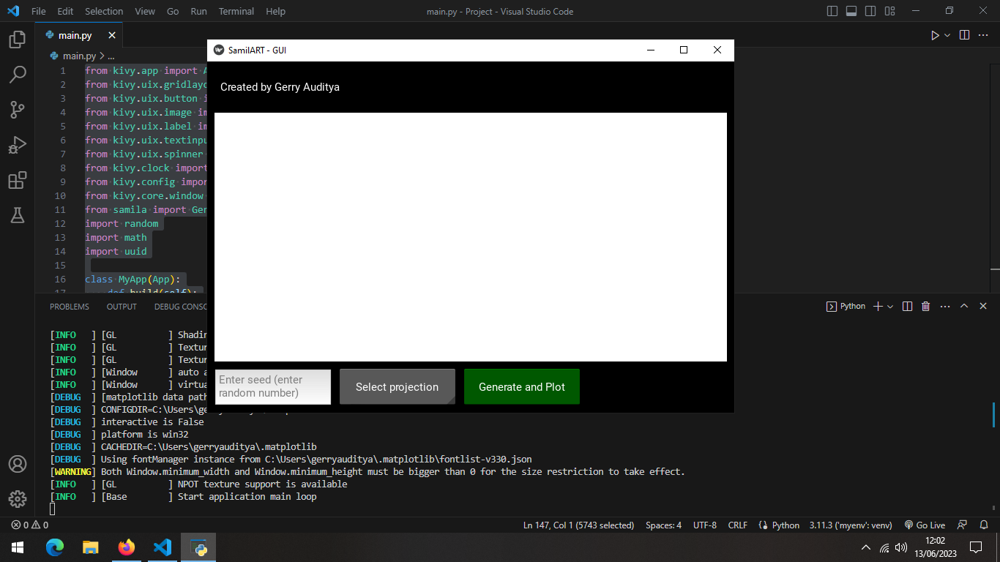
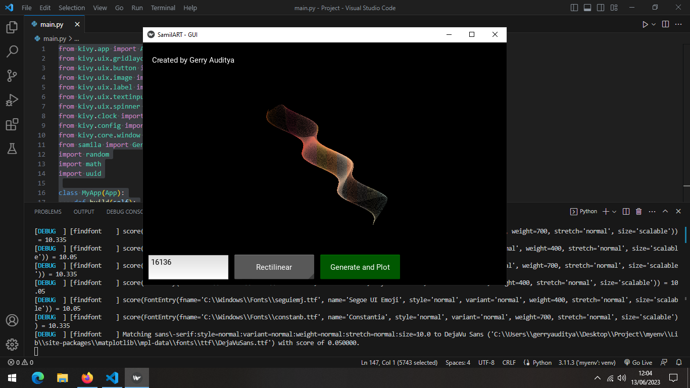

# SamilaRT-GUI

This repository contains a graphical user interface (GUI) program called [SamilaRT](https://github.com/gerryauditya6/SamilaRT).     
SamilaRT generates and plots generative images based on mathematical functions using the Kivy framework.

## Installation

To use the SamilaRT-GUI program, follow these steps:

```
git clone https://github.com/gerryauditya6/SamilaRT-GUI.git
```

Make sure you have Python 3.x installed on your system.    
Install the required dependencies by running the following command:
```
pip install -r requirements.txt
```


## Usage

To run the SamilaRT-GUI program, navigate to the cloned repository's directory and execute the following command:
```
python samilartgui.py
```

This will launch the SamilaRT-GUI application.

## Instructions

To generate and plot a generative image using the SamilaRT-GUI program, follow these steps:

1. Enter a seed value in the seed input field. If left empty, a random seed will be used.

2. Select a projection type from the projection spinner. The available options are Rectilinear, Polar, Aitoff, Hammer, Lambert, and Mollweide.

3. Click the "Generate and Plot" button.

5. Once the image generation is complete, the generated image will be displayed in the image area.

6. The generated image will be saved in the "Output" folder within the repository. The folder name will be a unique identifier.

7. You can find the configuration details of each generated image in the respective image folder within the "Output" folder.

8. To generate and plot a new image, repeat steps 1 to 7.

Note: The program uses mathematical functions to generate the images. The specific functions used can be found in the code (main.py) under the f1, f2, f3, and f4 functions.

## Configuration

The program allows you to configure the following settings:

- Seed: The seed value determines the randomization used in generating the images. You can enter a specific seed or leave it empty for a random seed.

- Projection: The projection type defines how the generated image is mapped onto a two-dimensional plane. You can select one of the available projection options: Rectilinear, Polar, Aitoff, Hammer, Lambert, or Mollweide.

## Screenshot
<div>
  
  
</div>
Visit my [OpenSea](https://opensea.io/Particleverse/collected) for more example.
